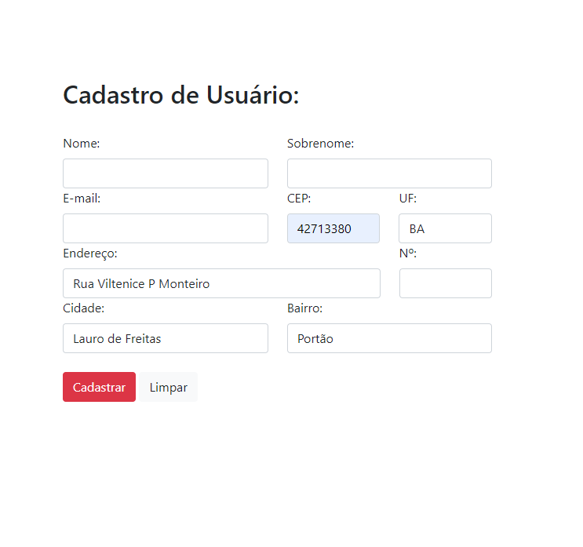

# API-javascript-CEP

<h2>
 ◻ Consulta de endereço automático usando a API de CEP
</h2>
<h3>
  Link da API: https://viacep.com.br/ws/42713380/json/
</h3>

  

 Ao preencher o campo de CEP e retirar o mouse, a consulta é feita e preenche 
  automaticamente os demais campos relacionados à endereço. 

